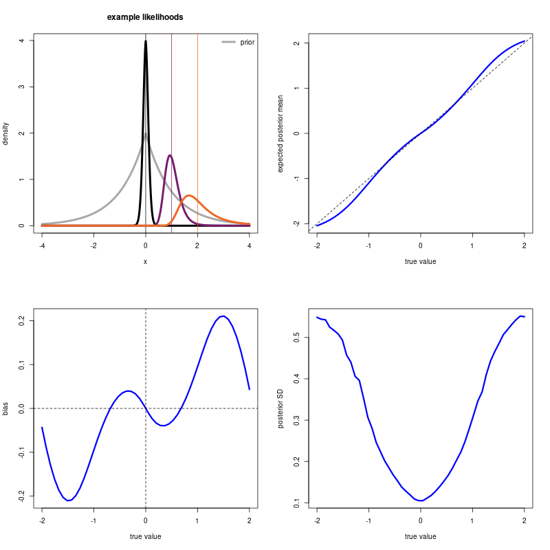
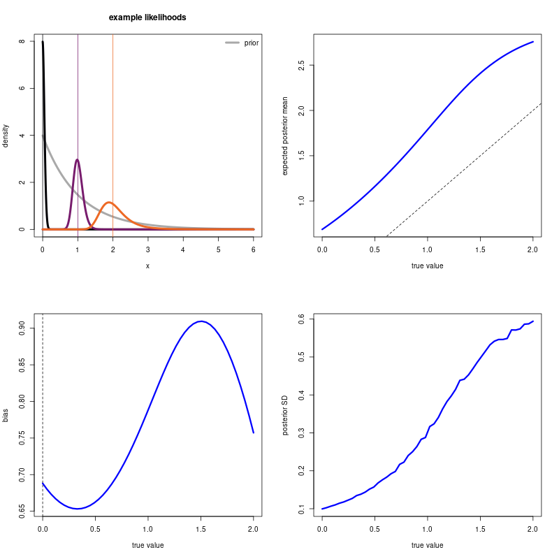

# Bayesian observer model constrained by efficient coding

Toy examples based on the work of Wei & Stocker ([2015](https://doi.org/10.1038/nn.4105), [2017](https://doi.org/10.1073/pnas.1619153114)).

### Laplacian prior

### Esponential prior

